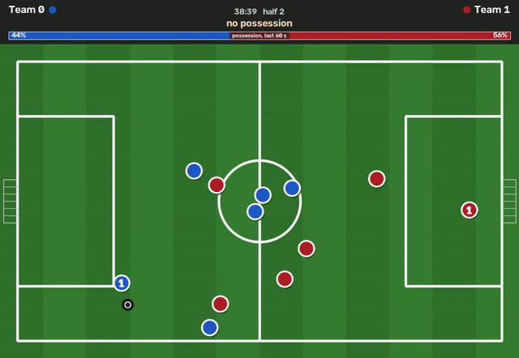
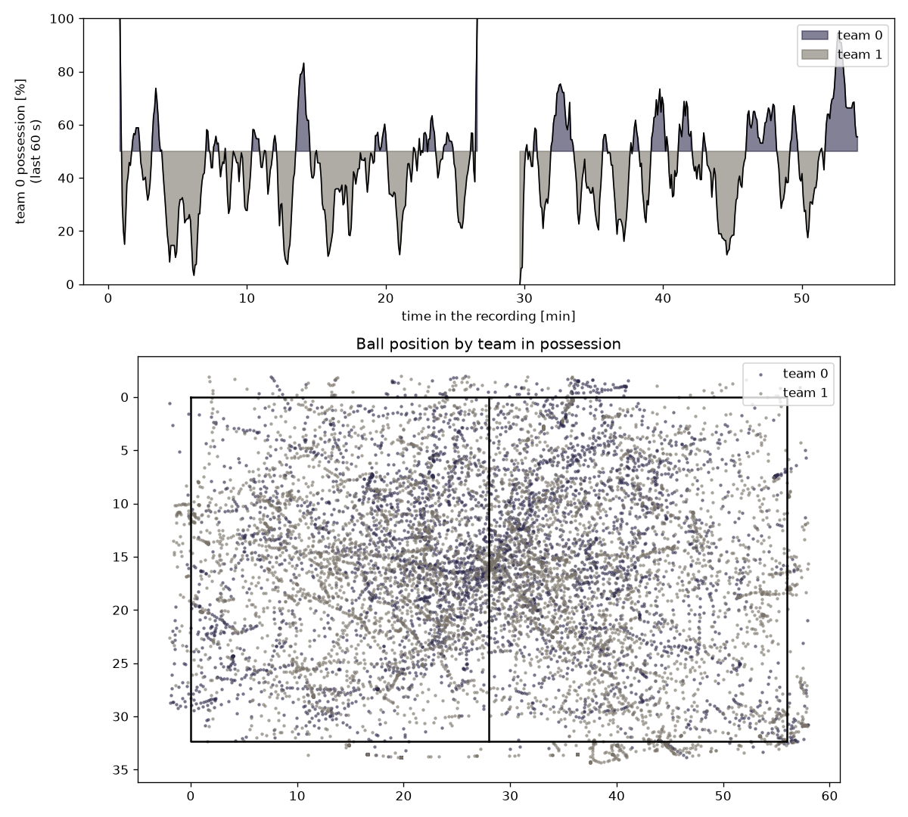
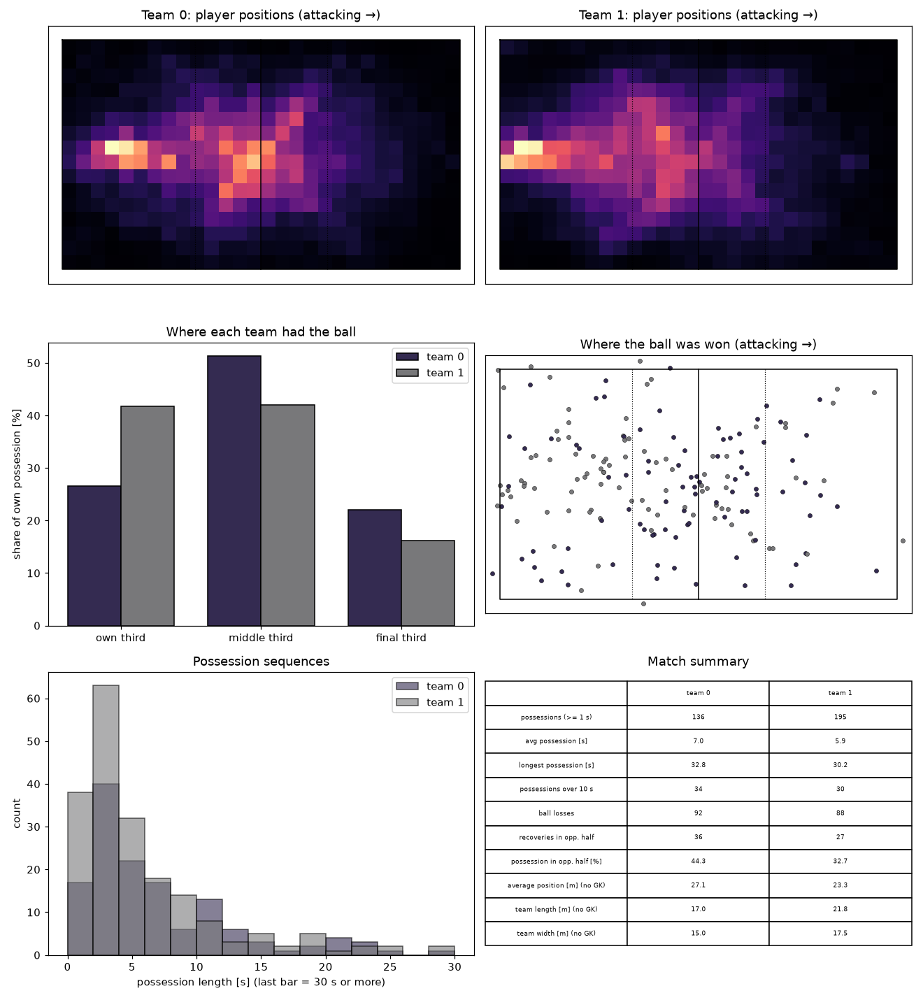

# Football Performance Analyst

Analysis of 6v6 football matches from video: ball possession, where on the pitch each team had the
ball, ball recoveries, team shape and team running distance, all in metres on the pitch.

> Status: the dual-lens analysis works end-to-end on full matches (calibration, detection, ball
> tracking, teams, possession, statistics, player tracks); detection model v8_dual.

## Recording
Matches are recorded with a Veo camera at the halfway line. Two recordings exist:
- **follow-cam**: a moving view that follows the ball (first version of this project, tag `followcam-v1`),
- **dual-lens**: the raw image of both wide-angle lenses, one above the other (2048×2048, each half
  shows one half of the pitch). The camera does not move, so every pixel maps to a position on the
  pitch in metres. **The current pipeline uses this recording.**

## How it works
1. **Lens calibration** – a fisheye model maps pixels to pitch coordinates. The two lenses are one rigid
   device, so a new match is calibrated automatically from a reference match: only the position and
   orientation of the camera are searched, by fitting the pitch lines of the model to the white lines
   detected in both halves.
2. **Detection** – players, referees and ball candidates in both halves (YOLOv8m, 2048 px), mapped to
   pitch coordinates. People outside the pitch (bench, coach, spectators) are dropped, a player seen by
   both lenses is kept once.
3. **Ball tracking** – the ball is followed in metres with a physical speed limit; spare balls lying next
   to the pitch are recognised and ignored; short gaps are interpolated.
4. **Teams and goalkeepers** – at every kick-off (start of a half, after a goal) each team stands on its own
   half, so the players on the two sides are labelled examples of the two kits (the kick-offs are found
   from the ball on the centre spot, or from the formation of the players alone). Every detection gets the
   team whose kit it resembles most, compared with the examples from the nearest kick-offs in time, so the
   change of light over the match is followed. Corrections: a player keeps his team along his track, and a
   team has at most five outfield players on the pitch. A goalkeeper belongs to the team that defends the goal
   he stands at. Without kick-offs the shirt colour is clustered over the whole match (K-means).
5. **Ball possession** – the player closest to the ball (within 1.5 m) controls it; possession changes
   after 0.3 s of control by the other team and stays with the passing team during a pass. Nobody has
   possession while the ball is out of the pitch (more than 1 m behind a line for at least 1 s) or lies
   still (2 s within 1 m: restart, free kick, corner).
6. **Statistics** – possession by thirds, recoveries and where they happen, possession sequences,
   team shape, heatmaps, all as if each team always attacked to the right (sides change after half time).
7. **Player tracks** – tracks of the players in metres; used for the team running distance and for the
   number of substitutions. Individual players are **not** identified (see limitations).

Only the playing time is analysed (half times are set per match, the half-time break is skipped).

## Example result
The numbers of the example match are being re-measured after the last corrections of the team assignment
(possession of a match is sensitive to it: between two versions of the analysis the same match moved by
several points). They will be added here with the measured accuracy of the possession (see *Known limitations*).






## Usage
```bash
# 1. half times of the match (asks for the start and the end of each half)
python match_config.py ~/football/videos/mecz3_dual.mp4 --preview

# 2. the whole analysis: calibration (from a reference match), detection, ball, teams, possession, tracks
python analyze_dual.py --match matches/mecz3.json \
    --model runs/detect/runs/v7_dual/weights/best.pt --ref mecz2

# a quick test on the first 5 minutes of play / rerun the later steps only
python analyze_dual.py --match matches/mecz3.json --model ... --limit 300
python analyze_dual.py --match matches/mecz3.json --model ... --from-step teams --reuse-colors

# 3. statistics and a check of the longest possessions (clips)
python match_stats.py ~/football/analysis/mecz3_dual --pitch pitch/pitch_6v6.json
python check_possessions.py ~/football/analysis/mecz3_dual --video ~/football/videos/mecz3_dual.mp4

# 4. passes, shots, xG, corners (estimates; the goals are read from restarts.json or given with --goals)
python match_actions.py ~/football/analysis/mecz3_dual --pitch pitch/pitch_6v6.json

# 5. match report as one HTML page (open it in a browser)
python match_report.py ~/football/analysis/mecz3_dual --pitch pitch/pitch_6v6.json --names "Team A,Team B" --score 11-2 --date 2026-09-20

# 6. top-down animation of 20 s of the match (MP4 and a small GIF)
python render_overlay.py ~/football/analysis/mecz3_dual --pitch pitch/pitch_6v6.json --start 12:30 --duration 20 --gif
```
Results in `~/football/analysis/<match>_dual/`: `detections.csv`, `ball.csv`, `teams.csv`, `possession.csv`,
`summary.json`, `stats.json`, `tracks.csv`, `players.csv`, `team_distance.csv` and the plots.
Optional: `--goals 14:21,21:29,...` gives the times of the goals, so that no possession is counted while
the ball is fetched and the teams take their places after a goal.

## Pitch
6v6 artificial pitch, 56 × 32.4 m. Penalty area 11.1 × 19.6 m, centre circle radius 4.75 m – estimated
from clicked line points together with the lens calibration (`refine_pitch.py`); the length was measured
on a satellite image. Definition with 19 keypoints: [`pitch/pitch_6v6.json`](pitch/pitch_6v6.json).

## Scripts
### Analysis of a match
| Script | Description |
|---|---|
| `analyze_dual.py` | The whole analysis of one match |
| `match_config.py` | Asks for the start and the end of each half, saves `matches/<match>.json` |
| `calibrate_match.py` | Automatic calibration of a match from a reference match (rigid two-lens camera model) |
| `dual_detect.py` | Detection in both halves, positions in metres, pitch filter, merging of both lenses |
| `dual_ball.py` | Ball tracking in metres (speed limit, spare balls, interpolation) |
| `dual_teams.py` | Teams learnt from the kick-offs (each team on its own half), goalkeepers by the side they defend, corrections along the tracks |
| `dual_possession.py` | Ball possession: out of play, ball lying still, per-frame CSV, summary, plots |
| `match_stats.py` | Zones, recoveries, possession sequences, team shape, heatmaps |
| `dual_tracks.py` | Player tracks in metres, team running distance, substitutions |
| `check_possessions.py` | Cuts video clips of the longest possessions to check them by eye |
| `match_events.py` | Restart windows after goals from given goal times (`--goals`) |
| `match_actions.py` | Estimated passes, shots, xG, corners and entries into the penalty area from the ball track (with a check against the goals) |
| `match_report.py` | Match report as one HTML page (top statistics, zones, team shape, possession timeline, heat maps, animation), the data also as JSON inside the page |
| `render_overlay.py` | Top-down animation of the match (circles, ball, possession bar) as MP4 and GIF |
| `draw_detections.py` | Short video of what the model detected (players by team, referees, ball candidates, the one the tracker used) |

### Calibration of a new camera (once per camera)
| Script | Description |
|---|---|
| `pick_pitch_points.html` | Browser tool: click pitch keypoints and points along the pitch lines on a frame |
| `calibrate.py` | Manual calibration of one lens (fisheye model fitted to keypoints and line points) |
| `refine_pitch.py` | Calibrates both lenses and estimates the pitch dimensions from the clicked lines |
| `fit_pitch_dims.py`, `auto_calibrate.py` | Helpers of the two scripts above and of `calibrate_match.py` |

### Dataset and experiments
| Script | Description |
|---|---|
| `extract_dual_frames.py` | Frames for annotation: evenly spaced, or the "hard" moments where the model misses the ball (gaps in the ball track, right after shots) |
| `prelabel_dual.py` | Pre-annotation for CVAT, detections outside the pitch are dropped using the calibration |
| `reid_probe.py` | Experiment: can the looks of players tell teammates apart? (result below) |

### Checks of the results (blind evaluation by eye)
| Script | Description |
|---|---|
| `compare_possession.py` | Picks moments (where analyses disagree, or random ones), saves an image of each with the ball marked; you write who had the ball; the answers of the analyses are kept apart so they do not steer you |
| `score_possession.py` | Scores the possession of one or more analyses on the moments you judged |
| `team_check.py` | Sheets of random player crops to judge by eye; scores how often the team assignment is right |
| `val_referee_check.py` | Referees and players in a validation set that labels only people on the pitch: found, lost, duplicates |
| `person_duplicates.py` | How many `referee` boxes lie on a `player` box in an analysis |
| `cut_detections.py` | Trims the detections of a finished analysis to the first N seconds, to compare models on a short piece without the slow detector |

The follow-cam version (moving view, positions in pixels) is kept in the tag `followcam-v1`.

## Dataset
- Frames extracted from match recordings, pre-annotated with the current model, corrected in CVAT
- Annotation guidelines: [`ANNOTATION.md`](ANNOTATION.md)
- Classes: `player`, `referee`, `ball` (goalkeepers are annotated as `player`)
- Train/validation split by match (not by frame)
- Videos, frames and datasets are not stored in this repository

## Installation
```bash
git clone https://github.com/hubixek/Football-performance-analyst.git
cd Football-performance-analyst
python3 -m venv .venv
source .venv/bin/activate
pip install -r requirements.txt
```
FFmpeg is required. A CUDA-capable GPU is recommended (trained and run on an RTX 3070, 8 GB).

## Detection results

### v8_dual (YOLOv8m, imgsz=2048) – dual-lens recordings, current model
Fine-tuned from v7_dual (SGD, `lr0=0.001`, cosine schedule, 1 warm-up epoch, `freeze=10`, `patience=30`, batch 2;
best epoch 45 of 75). Data: 248 training frames of two matches (`mecz2` 96, `mecz4` 152). Two validation sets,
both of matches that were not in the training: `mecz1` (134 frames) and `mecz4_2` (206 frames; only the people and
balls ON the pitch are labelled, so the `referee` row of that set is not meaningful: a referee behind the line is
detected but counts as a false positive). Both models were evaluated with the same version of Ultralytics.

| | v7_dual `mecz1` | **v8_dual `mecz1`** | v7_dual `mecz4_2` | **v8_dual `mecz4_2`** |
|---|---|---|---|---|
| player mAP50 / mAP50-95 | 0.962 / 0.897 | 0.947 / 0.892 | 0.970 / 0.900 | **0.987 / 0.932** |
| referee mAP50 / mAP50-95 | 0.905 / 0.775 | 0.880 / 0.751 | (not meaningful) | (not meaningful) |
| ball mAP50 / mAP50-95 | 0.558 / 0.419 | **0.690 / 0.506** | 0.590 / 0.468 | **0.671 / 0.573** |

With 55 and 91 balls in the validation sets the uncertainty of the ball rows is about ±5 points; the gain of v8
over v7 is the same on both matches. On the pitch v8 finds 98% of the players (v7: 94%) and loses a player as a
referee in 0.7% of the cases (v7: 2.3%).

### v7_dual – previous model
Fine-tuned from v6 on 96 frames of one match (`mecz2`).

Players are detected more precisely than on the follow-cam view (no motion blur, no cut-off players).
The ball is small in the wide view and is the weakest class.

### Follow-cam models (v1–v6)
Evaluated on a different validation set (one follow-cam match) – not comparable with v7_dual.

| Model | Setup | player mAP50 | referee mAP50 | ball mAP50 |
|---|---|---|---|---|
| v6 | YOLOv8m, 1920 px, 4 matches | 0.940 | 0.881 | 0.752 |
| v5 | YOLOv8s, 1920 px, 4 matches | 0.966 | 0.911 | 0.692 |
| v4 | YOLOv8s, 1920 px, 2 matches | 0.920 | 0.883 | 0.562 |
| v3 | YOLOv8s, 1280 px, goalkeeper merged into player | 0.954 | 0.903 | 0.493 |
| v2 | YOLOv8s, 1280 px, 4 classes (goalkeeper mAP50 0.431) | 0.914 | 0.904 | 0.499 |
| v1 | YOLOv8s, 1280 px, 1 match, 4 classes | 0.916 | 0.838 | 0.427 |

Lessons: full frame resolution mattered most for the ball (v3 → v4), more matches improved every class
(v4 → v5), goalkeepers cannot be told apart from players by colour on a wide view (v2 → v3).

## Lessons from the experiments
- Fine-tuning a finished model needs a small learning rate and frozen early layers (`lr0=0.001`, `freeze=10`);
  with the default settings the best epoch was the first one and the model got worse afterwards.
- Training longer on the same frames did not help (505 epochs: no gain over 45); more matches in the training will.
- The mAP of the ball did not predict the quality of the possession: a model with a better ball lost a blind check
  of the possession until the team assignment was corrected. Models are therefore compared with the blind checks
  above, not with the mAP alone.
- The validation labels must follow one rule: label only the people and balls on the pitch, as the pipeline does.

## Known limitations
- **Players are tracked, not identified.** Teammates wear the same kit, players crowd around the ball and
  substitutions are rolling, so a track holds pieces of several players. The looks of teammates (colour of
  head, shirt, shorts and socks, `reid_probe.py`) tell them apart only partly (AUC 0.75; the differences
  are mostly the shorts) and the tracks used for the test were not clean, so there are no per-player
  totals. Reliable: team distance, team shape, heatmaps, number of substitutions (about 3 of 4 changes).
- Passes, shots and xG are estimates from the ball track: the ball is visible in about 76% of the frames and is lost most easily when it flies fast, so the numbers of passes and shots are lower bounds (on simulated matches about half of the passes and a third to a half of the shots are found; the pass accuracy is reliable). The report hides shots and xG when the ball track finds fewer than half of the goals as shots.
- Team assignment (on 99 random player crops of `mecz1`, judged by eye): 91% right after the kick-off method,
  against 83% with the shirt colour clustered over the whole match. The mistakes are mostly dark shirts taken
  for light ones and referees taken for players.
- Possession is sensitive to such details (two nearly identical detection models differed by 4 points of
  possession in 8 minutes). On the moments where analyses disagree the models are right in about 40% of the
  cases; this is not the overall accuracy, which is still to be measured on random moments (`compare_possession.py --random`).
- The ball is small and lost in about 24% of the frames, and hard to see at the centre spot; goals and
  kick-offs are therefore not detected automatically (`--goals` takes the goal times, optional).
- Goalkeepers are recognised at the kick-off of each half (own kit); a goalkeeper kit similar to a team's
  kit switches this off with a warning.

## TODO
- [x] Detection models (v1–v8), annotation workflow with pre-annotation and CVAT
- [x] Fisheye calibration, pitch dimensions estimated from the image, automatic per-match calibration
- [x] Dual-lens analysis in metres: detection, ball, teams and goalkeepers, possession, statistics, tracks
- [x] Teams from the kick-offs, blind checks of the teams and of the possession, a second validation match
- [ ] More annotated dual-lens matches (evening and night), hard frames: false balls on socks and heads, gaps in the ball track
- [ ] Goal and kick-off detection (needs the better ball detection)
- [ ] Possession accuracy measured on random moments, and the common mistakes of the possession logic
- [ ] Automated tests and CI

## Author
Hubert – [GitHub](https://github.com/hubixek)
